# Natural Language Processing in Microsoft Azure

This repository has the purpose of storing the project developed within the scope of the "Natural Language Processing" module of the "Microsoft Azure AI Fundamentals" Bootcamp by [DIO](https://www.dio.me/), under the instruction of the teacher [Valéria Baptista](https://www.linkedin.com/in/valeriabaptista/).

The project is an essential requirement for passing the "Natural Language Processin" module, consolidating participants practical learning and preparing them for subsequent challenges.

The development of this project aims to identify Azure AI services that include natural language processing, specifically speech-to-text and sentiment analysis services. For a better understanding, i divided the entire process into steps,from creating resources to the final result of conversion and sentiment analysis.

## Speech-to-Text

### Step 1: Creating  a Resource to Speech-to-Text

Let's start by accessing the following Microsoft portal: https://speech.microsoft.com/portal.

In the [Speech Studio](https://speech.microsoft.com/portal) portal, we will create a new resource.

  

You will need to fill in some information to create a speech resource.

  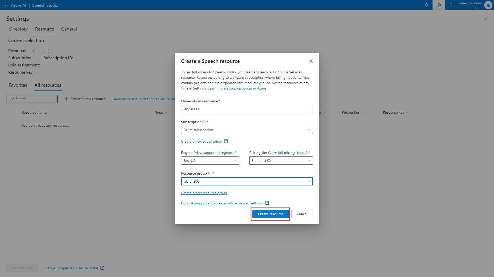

We will use the created resource to start our work.

  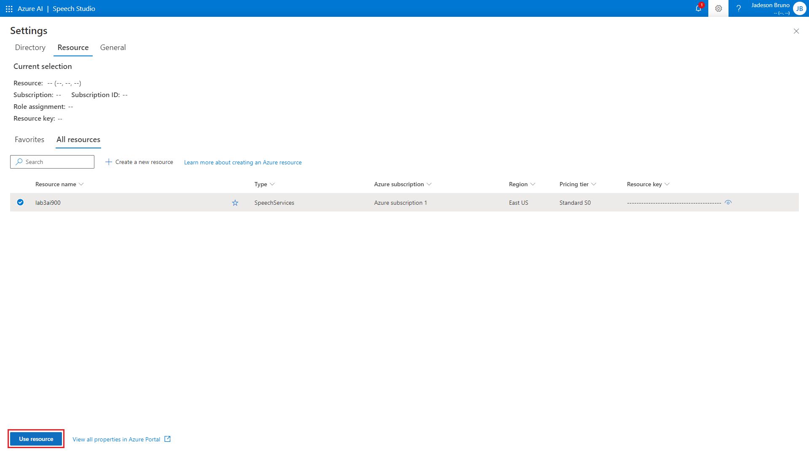

### Step 2: Selecting Real-time speech to text

In the Speech to text category we will select Real-time speech to text.

  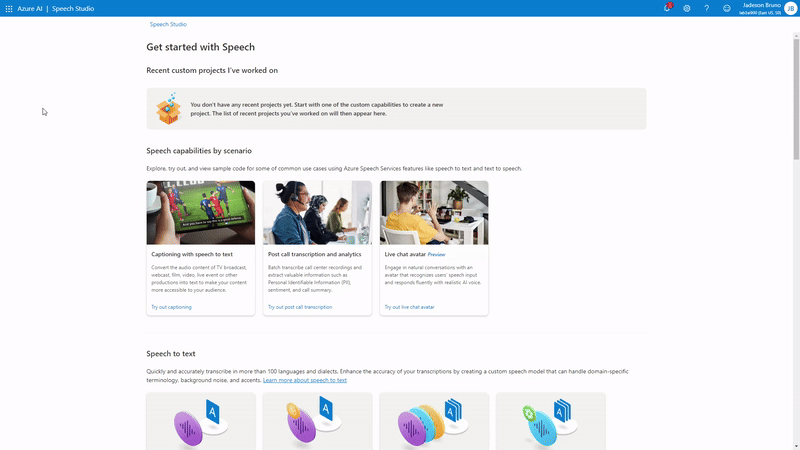

### Step 3: Speech to text conversion

It is important to configure the language of the audio that will be loaded. After that, we will select our file in the directory corresponding to our desktop and have our speech converted into text.

For the laboratory i chose a biblical excerpt in English. 

Used audio: [01_mattew_11_28_30.mp3](./inputs/01_mattew_11_28_30.mp3).

  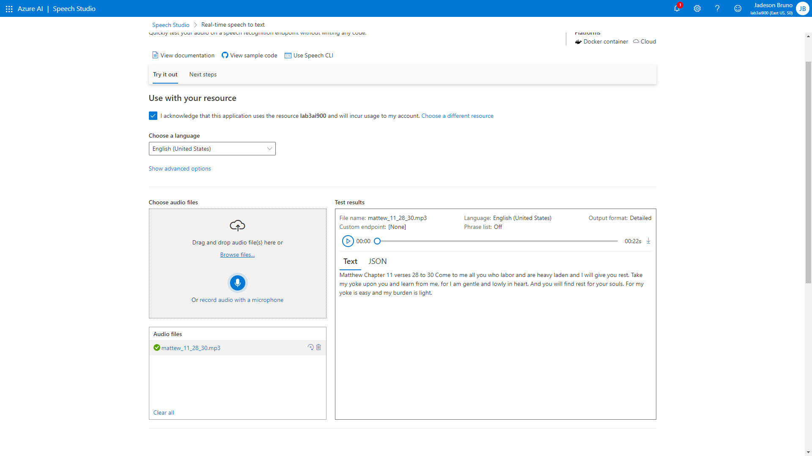

Result in text: Matthew Chapter 11 verses 28 to 30 Come to me all you who labor and are heavy laden and I will give you rest. Take my yoke upon you and learn from me, for I am gentle and lowly in heart. And you will find rest for your souls. For my yoke is easy and my burden is light. 

The result in json format can be seen here: [01_result_of_converting_speech_to_text.json](./outputs/01_result_of_converting_speech_to_text.json).

### Step 4: Next Steps

We can use the Real-time speech to text service to integrate it with different programming languages to create personalized applications that use this feature.

## Sentiment Analysis

### Step 1: Creating a resource to sentiment analysis

First, let's access the [Microsoft Azure](https://portal.azure.com/#home) portal.

Let's create a resource and configure it.

  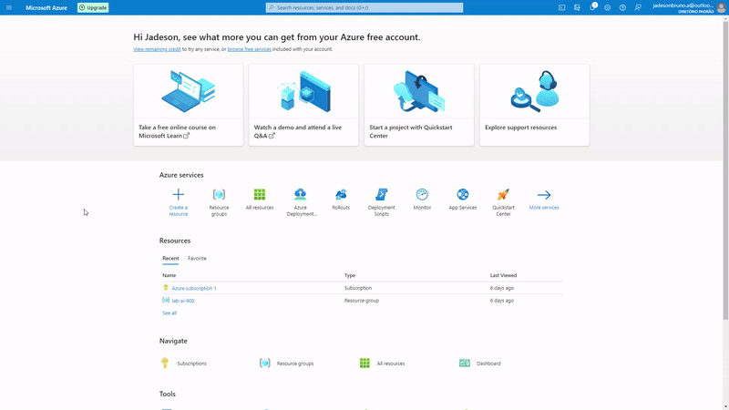

Now, let's configure the resource.

  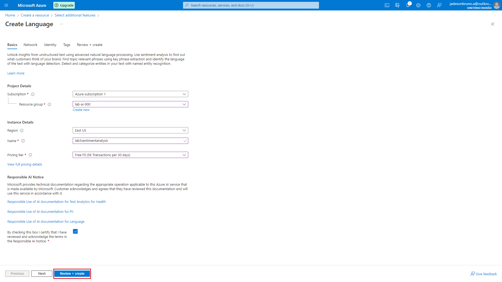

  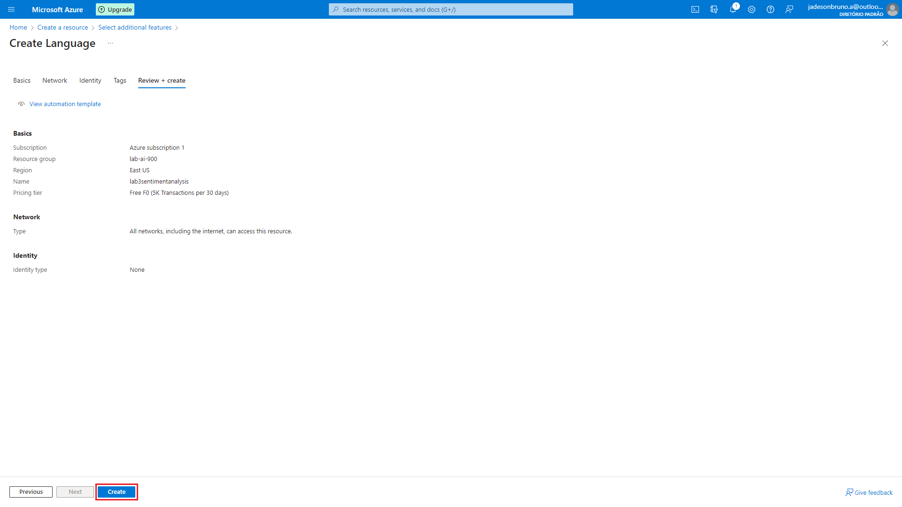

By going to the resource group, we can confirm the deployment.

  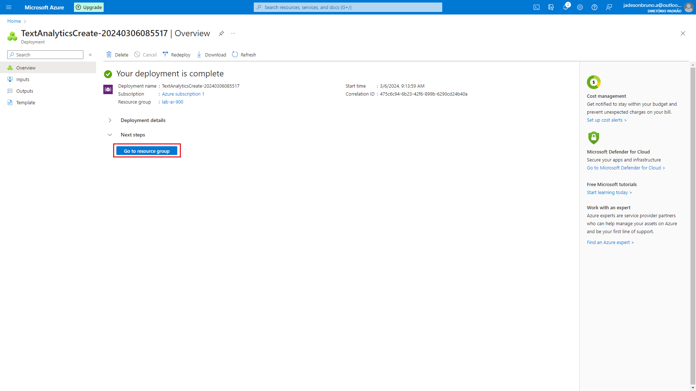

  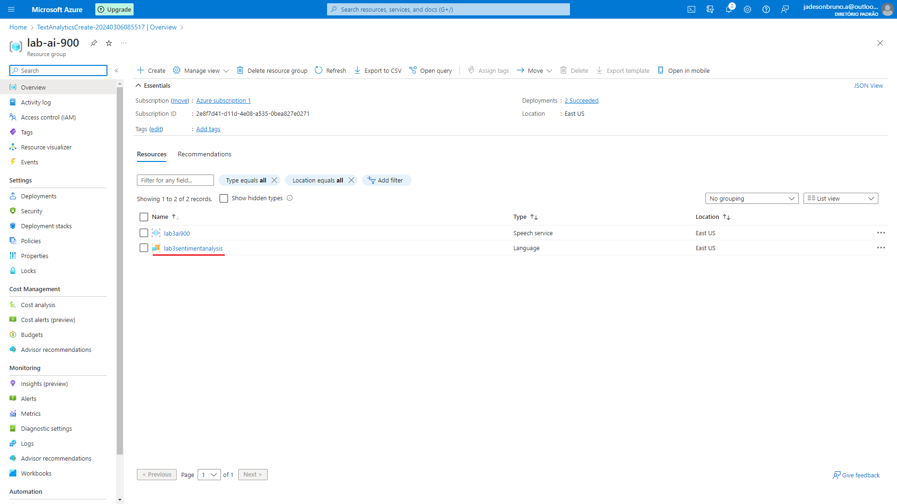

## Step 2: Select an Azure resource

After completing this creation stage, we go to the [Language Cognitive](https://language.cognitive.azure.com/) portal.

To access Language Studio we need to link it with an Azure resource.

  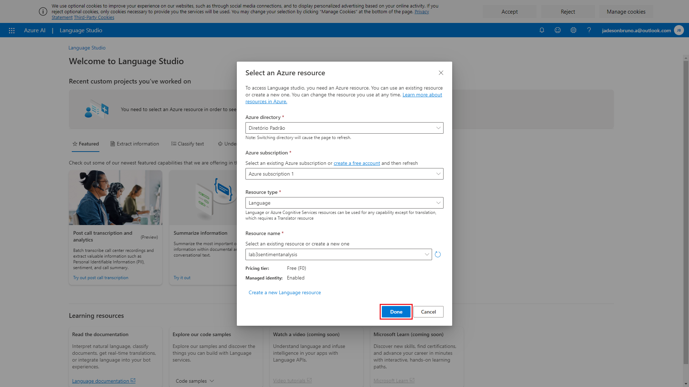

### Step 3: Selecting analyze sentiment and mine opinions

To perform sentiment analysis in Azure we can select "Selecting analyze sentiment and mine opinions".

  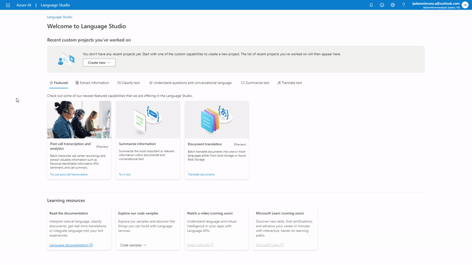

By selecting the text from our directory to perform sentiment analysis, we will be able to obtain the results.

Text file used: [02_review_of_the_royal_hotel.txt](./inputs/02_review_of_the_royal_hotel.txt).

  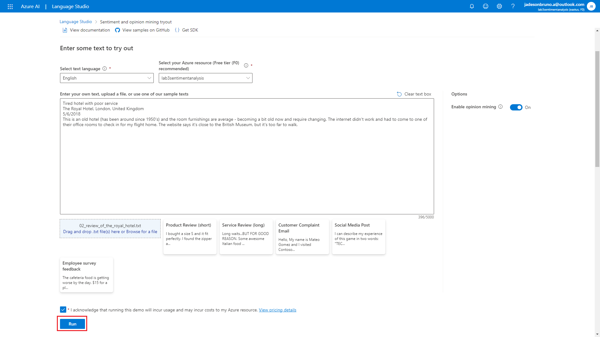

### Step 4: Examining the results

**Sentence 1:**

  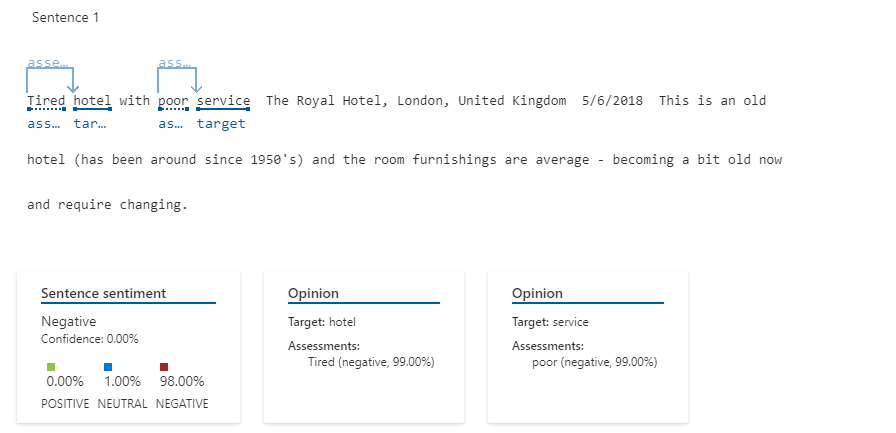

**Sentence 2:**

  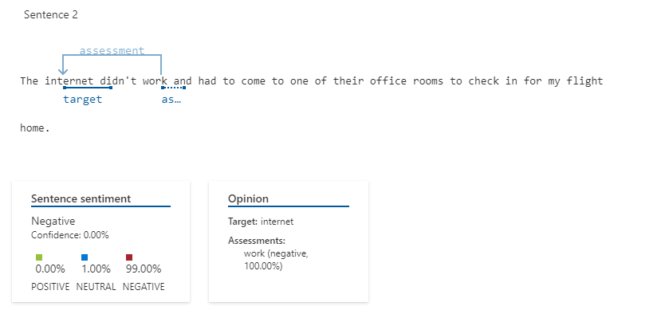

**Sentence 3:**

  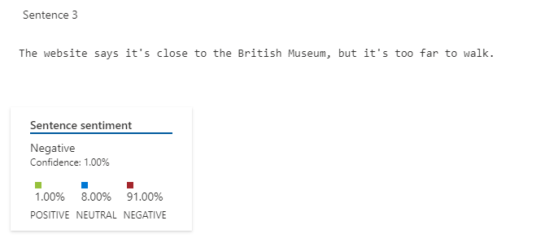

**Original Text:**

  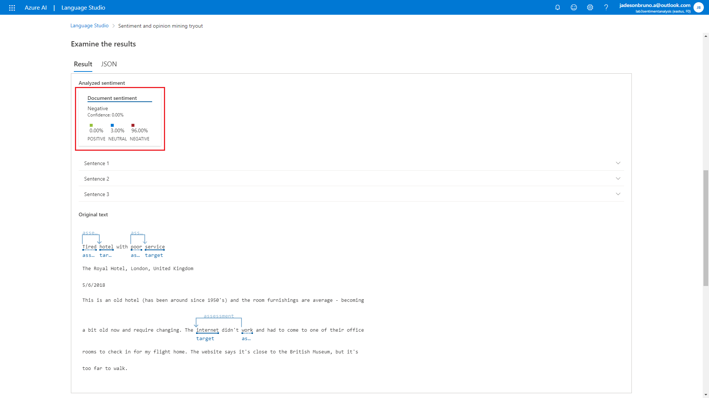

Analyzing the results we realized that sentiment analysis is classified into three variables: positive, neutral and negative. **Positive** denotes positive feelings such as "happy", "great", "lovely", among others. **Neutral** refers to neutral and objective statements that do not express a strong emotional opinion. **Negative** denotes the presence of words with negative feelings, such as "sad", "bad", "frustrating", among others.

In our text, we noticed the customer's frustration with the hotel, and this will lead our sentiment analysis to a higher percentage in Negative.

The result in json format can be seen here: [02_sentiment_analysis.json](./outputs/02_sentiment_analysis.json).

### Step 5: Next Steps

We can use the "Analyze sentiment and mine opinions" service to integrate it with different programming languages to create personalized applications that use this feature.

## Useful Links:

[Explore Speech Studio](https://microsoftlearning.github.io/mslearn-ai-fundamentals/Instructions/Labs/09-speech.html)

[Analyze text with Language Studio](https://microsoftlearning.github.io/mslearn-ai-fundamentals/Instructions/Labs/06-text-analysis.html)

## Tecnologias Utilizadas

- Microsoft Azure AI Speech Studio
- Microsoft Azure AI Language Studio

## Contributions

Contributions are welcome. Feel free to suggest improvements and possible fixes to the code through an issue or pull requests.

## Author

Jadeson Bruno Albuquerque da Silva

